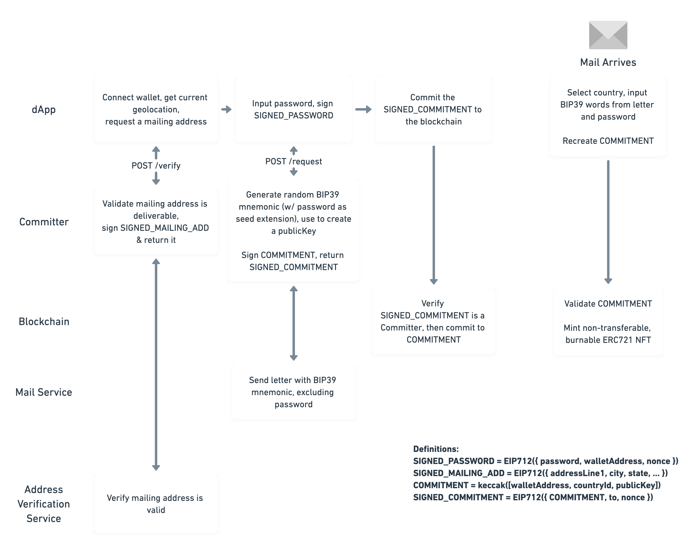

# Proof of Residency Whitepaper

## Motivation

The web3 ecosystem has benefited from the anonymity and transparency of the underlying smart contracts. Many of the current protocols being developed are moving towards integrating real-world identity into web3, while maintaining privacy of the participating users.

There has been an explosion of DAOs in the recent years, solving complex organizational problems with the backing of the blockchain. Many of these projects have experimented with [coin voting governance](https://vitalik.ca/general/2021/08/16/voting3.html), which has been criticized for misaligned incentives and conflicts of interest. One of the notable solutions to governance (and many other problems) are Proof of Personhood protocols which . There have been [recent reviews](https://arxiv.org/abs/2008.05300) of the notable projects which have made attempts at Proof of Personhood and their approaches to the problem.

This project is a novel attempt at Proof of Personhood - we prove humanness by sending physical mail with a secret phrase, and use a **commit-reveal scheme** to ensure that the recipient resides at the provided address. The physical address is kept private and names are not requested.

## Approach



### Step 1: Commitment

First, in order to verify that a user resides at an address, we use multiple data points to reduce fraud. The user must input an address which they would like to prove residency at. They must then allow the dapp to request geolocation using the browser. This will provide the dapp with a longitude/latitude, which must be within 2km of the address which they input.

If they choose to continue to validate this physical address, they will be asked to input a password which will be used as a "seed extension" for a BIP39 mnemonic phrase.

The mailing address + password payload is signed and sent to the backend, which generates a BIP39 mnemonic and uses the password as the BIP39 passphrase to create a public/private keypair.

```typescript
const mnemonic: string = bip39.generateMnemonic();
const seedBuffer: Buffer = await bip39.mnemonicToSeed(mnemonic, password);
const { publicKey, privateKey } = bip32.fromSeed(seedBuffer);
```

The `mnemonic` (without the user-provided `password`) is sent to Lob and physical mail is triggered. This ensures that Lob does not have enough information to be able to recreate the private/public key, since they are never aware of the password from the user. _The backend does not record the user's password, so there is no way to verify the user's original request if they forget their password._ No user information is stored in a centralized database.

We use [Lob](https://www.lob.com/) as the backing mail service. Lob is a centralized API which allows physical mail to be sent from an API call. We use this as a core piece to Proof of Residency, but acknowledge that the service could be compromised. We take steps to mitigate risk of their services being compromised, and plan to reduce dependency on this service by eventually incorporating other Address Verification services.

The generated `publicKey` is then hashed alongside the wallet address and country ID.

```typescript
const walletAddress = ethers.utils.verifyMessage(payload, signature);

const hash = ethers.utils.keccak256(
  ethers.utils.defaultAbiCoder.encode(
    ['address', 'uint256', 'string'],
    [walletAddress, countryId, publicKey]
  )
);
```

The hash is then signed by the backend, which has the credentials for a trusted EOA which has been granted the role of committer in the smart contract. This is passed to the dApp, which sends the signed hash payload to the smart contract. The contract verifies that the trusted EOA signed the commitment and stores the commitment on-chain.

```typescript
...add code here
```

### Step 2: Reveal

Once the user receives the letter with the BIP39 mnemonic, they now have all of the information they need to prove that they reside at the address in question. In the letter, are instructed to return back to the website and re-enter their claimed address, and then enter the remaining BIP39 words alongside their password to regenerate the public key. The public key and country ID are then sent with the user's wallet address to the smart contract. **There is a required time delay of one week between requesting and minting, for security of the system.** See Known Attack Vectors for more information.

The address parameters are then used to reconstruct the original signed message and the signer is verified to ensure that the message was signed with the original random BIP39 mnemonic generated by the backend.

If the signature is valid, then a non-transferable ERC-721 token is minted with the country information. The user pays a gas fee as well as a minimal ETH amount to cover the [costs of sending a letter through Lob](https://www.lob.com/pricing/print-mail) and development costs of the platform (this is a variable cost set by an owner of the contract, which is ideally as low as possible to support innovation on top of the platform).

### NFT

An NFT is issued with the metadata stored in IPFS. The IPFS URL is passed as the `tokenUri` for the ERC721 implementation. The structure of this metadata follows [OpenSea's standards](https://docs.opensea.io/docs/metadata-standards):

```json
{
  "name": "New York-Newark-Jersey City, NY-NJ-PA: #1",
  "description": "Inspired by the study of cartography in New York. Proof of Residency is an NFT generative art project based on maps; every design is created from content stored immutably on the Ethereum blockchain. Minting is limited to one NFT per mailing address and can only be completed after physical mail is received, as a first-ever experiment into city-based limits on token supply. Designs are inspired by real-world maps of hydrography and transportation networks.",
  "background_color": "aadaee",
  "external_url": "https://proofofresidency.xyz/token/1",
  "image": "ipfs://bafybeid6qz46vjlncd4o7mepaazbnvpakcifedkbnrui5hly4xjajev554/token/1.png",
  "animation_url": "ipfs://bafybeid6qz46vjlncd4o7mepaazbnvpakcifedkbnrui5hly4xjajev554/1.html",
  "tags": ["proof-of-residency", "generative-art"],
  "attributes": [
    {
      "trait_type": "Type",
      "value": "Rivers/Lakes"
    },
    {
      "trait_type": "Background",
      "value": "Light"
    },
    {
      "trait_type": "Theme",
      "value": "Blue Sky"
    },
    {
      "trait_type": "Type Iterations",
      "value": 1
    },
    {
      "trait_type": "State Iterations",
      "value": 3
    },
    {
      "trait_type": "State",
      "value": "New York"
    },
    {
      "trait_type": "City",
      "value": "New York-Newark-Jersey City, NY-NJ-PA"
    },
    {
      "trait_type": "Country",
      "value": "United States of America"
    }
  ]
}
```

## Known Attack Vectors/Tradeoffs

1. The backend API is centralized, which requires trust in the maintainers of this project to continue to operate honestly when making commitments on-chain. If the backend EOA account is compromised or otherwise behaves in a detrimental way to the community, they could provide false commitments which could subsequently result in fraudulent Proof of Residency tokens. This could have massive, negative downstream effects for any project using the protocol. This is partially addressed by the required time delay of one week between commitment and minting. This is more fully addressed below in Future Goals.

2. A significant amount of trust is placed in Lob's mailing service, and while they aren't given all of the information to be able to generate the `publicKey` which is committed to, they could look at API logs and tie API requests to wallet addresses which interacted with the blockchain based on timestamps. This can be partially mitigated by queuing requests to Lob with random jitter, but this would not fully solve the problem.

3.

## Future Goals

### Decentralization

Once the protocol grows to a point that it is necessary to begin decentralization, a few goals will begin being worked on:

1. A DAO will be formed with all participants having a single vote based on their `PORP` ERC721 token.

2. The dApp/backend can be hosted by numerous parties, since the code is open-source. These new committer EOA accounts would be voted on by the DAO, and could be removed by the DAO if they behave poorly. This would also include the original EOA account of the maintainers. There is a financial incentive for the committer to continue to provide honest commitments.

3. The new ERC721 tokens which are minted would be monitored by the community. Once numerous parties have committer credentials, there would need to be checks in place to ensure they are behaving honestly. A solution to this would be community votes on removing a committer account and burning all of the tokens it issued.
